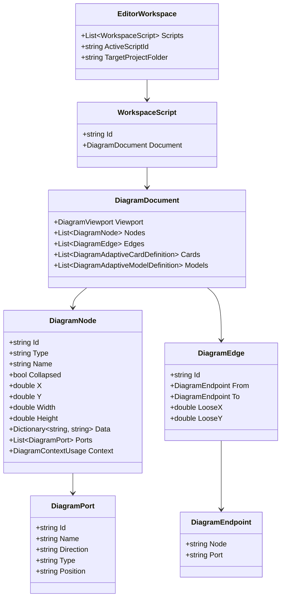
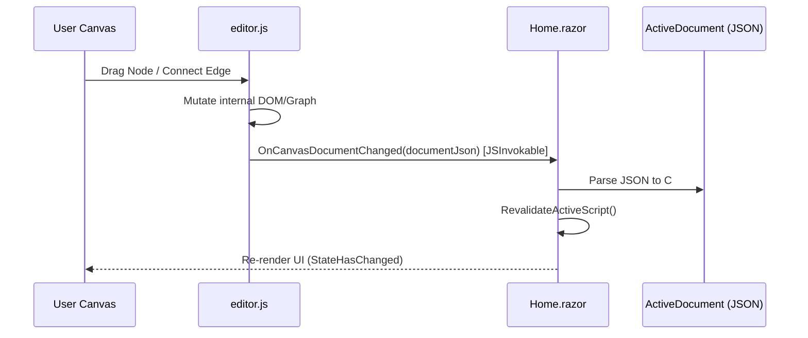

# ScriptEditor: As-Is Architecture & System Documentation

**Status:** Current Baseline (As-Is)  
**Date:** September 2026  
**Document Purpose:** Baseline technical documentation of the experimental `ScriptEditor` implementation to facilitate gap analysis, refactoring, and transition to the target n8n-style agentic workflow architecture.

---

## 1. Executive Summary & Vision

### 1.1 Original Mission
The goal of `ScriptEditor` is to provide a visual diagramming and authoring environment for designing conversational topics and agentic workflows that execute on the **ConversaCore** conversational AI framework.

### 1.2 The As-Is Reality
The current codebase was developed as an experimental prototype. While it contains valuable foundational ideas—specifically representing conversational flows through a declarative JSON graph—it has accumulated severe architectural compromises:
* **Brittle Canvas Implementation:** The diagram canvas relies on a massive (~2,100 line) custom vanilla JavaScript DOM and SVG renderer with manual coordinate calculation, DOM-based node management, and Dagre layout integration.
* **Duplicated Codebase Debt:** Approximately 40 activity C# classes were copied directly from `ConversaCore` into the `Activities/` folder, requiring MSBuild exclusions to avoid collision with the referenced library.
* **Absence of Code Transcription:** The C# code generation/transcription engine is not implemented; workflows currently exist solely in JSON or browser `localStorage`.
* **Clunky Inspector UX:** Node configuration relies on editing raw JSON strings inside textareas in a sidebar rather than structured, activity-aware configuration forms.

### 1.3 Target Architecture Principles
1. **JSON is the Single Source of Truth:** Any diagram change must mutate the JSON model first; the canvas merely renders a view of that JSON.
2. **Bi-Directional Code ↔ JSON Sync:** Code is transcribed from the JSON structure, and changes in code parse back into JSON, protected against circular updates, deadlocks, and infinite event loops.
3. **No Local Activity Source Files:** `ScriptEditor` must not duplicate framework activity classes; it must reflectively discover activity definitions, parameters, and metadata directly from the referenced `ConversaCore` assembly.
4. **n8n-Style Workflow Experience:** Clean canvas ergonomics with an n8n-inspired visual aesthetic, intuitive port connections, and a dedicated, schema-driven node configuration side-panel.

---

## 2. Solution Structure & Dependencies

### 2.1 Solution Layout
```text
ScriptEditor/
├── Activities/                  # Technical debt: duplicated ConversaCore activities
│   ├── Base/                    # Core workflow base classes (excluded via csproj)
│   ├── AdaptiveCardActivity.*   # Form/Card activity implementation
│   ├── ChoiceActivity.cs
│   ├── CompleteTopicActivity.cs
│   ├── ConditionalActivity.cs
│   ├── PromptActivity.cs
│   └── ... (approx. 40 activity files)
├── Components/
│   ├── Layout/                  # MainLayout, NavMenu
│   └── Pages/
│       ├── Home.razor           # Primary Blazor shell, inspector, script bar (~1,400 LOC)
│       ├── Home.Adaptive.cs     # Partial: Adaptive Cards/Models serialization
│       ├── Home.DndDiagnostics.cs # Partial: Drag-and-drop diagnostic instrumentation
│       ├── Home.TargetProject.cs# Partial: Scans disk to verify ConversaCore wiring
│       └── ...
├── Models/
│   ├── DiagramDocument.cs       # Core document, node, edge, port, and card DTOs
│   ├── DiagramValidation.cs     # Validation rules for diagram graph integrity
│   └── EditorWorkspace.cs       # Multi-script workspace and localStorage cloning
├── Properties/                  # launchSettings.json
├── wwwroot/
│   ├── editor.js                # Monolithic JS canvas controller (~2,100 LOC)
│   ├── layoutEngine.js          # Dagre layout integration
│   ├── editor/
│   │   ├── core/                # normalize.js, ports.js, types.js
│   │   └── rendering/           # renderNode.js, renderEdges.js, renderPorts.js, renderAdaptiveNodes.js
│   └── ...
├── Program.cs                   # ASP.NET Core 9 minimal startup (InteractiveServerComponents)
└── ScriptEditor.csproj          # Project definition and compile hacks
```

### 2.2 Project Dependencies & Compiler Hacks
In `ScriptEditor.csproj`:
```xml
<Project Sdk="Microsoft.NET.Sdk.Web">
  <PropertyGroup>
    <TargetFramework>net9.0</TargetFramework>
    <Nullable>enable</Nullable>
    <ImplicitUsings>enable</ImplicitUsings>
  </PropertyGroup>

  <ItemGroup>
    <ProjectReference Include="..\InsuranceSemanticV2\ConversaCore\ConversaCore.csproj" />
  </ItemGroup>

  <ItemGroup>
    <Compile Remove="Activities\Base\**\*.cs" />
    <Compile Include="Activities\Base\Interfaces\ITopicTriggeredActivity.cs" />
    <Compile Include="Activities\Base\Interfaces\ICustomEventTriggeredActivity.cs" />
  </ItemGroup>
</Project>
```
* **Critical Finding:** The project references `ConversaCore.csproj` from the sibling repo `InsuranceSemanticV2`, yet also includes ~40 activity `.cs` files in `Activities/`.
* Because `ConversaCore` already defines these types, the compiler produced collisions, leading to the `<Compile Remove="Activities\Base\**\*.cs" />` workaround.

---

## 3. Data Model & JSON Specification

The data contract is defined in `Models/DiagramDocument.cs`. It serves as the serialized document format:



### 3.1 JSON Schema Overview
```json
{
  "viewport": {
    "panX": 24.0,
    "panY": 18.0,
    "zoom": 1.0
  },
  "nodes": [
    {
      "id": "chat-input-1",
      "type": "chat-input",
      "name": "User Greeting",
      "collapsed": false,
      "x": 120.0,
      "y": 80.0,
      "width": 320.0,
      "height": 260.0,
      "data": {
        "prompt": "Hello! How can I help you today?"
      },
      "ports": [
        {
          "id": "chat-input-1-out",
          "name": "Output",
          "direction": "output",
          "type": "string",
          "position": "right"
        },
        {
          "id": "chat-input-1-exception-out",
          "name": "Exception",
          "direction": "output",
          "type": "any",
          "position": "custom-bottom-85"
        }
      ],
      "context": {
        "reads": [],
        "writes": ["LastUserMessage"]
      }
    }
  ],
  "edges": [
    {
      "id": "edge-1",
      "from": { "node": "chat-input-1", "port": "chat-input-1-out" },
      "to": { "node": "simple-activity-2", "port": "simple-activity-2-in" }
    }
  ],
  "cards": [],
  "models": []
}
```

### 3.2 Graph Validation Engine (`Models/DiagramValidation.cs`)
A static `DiagramValidator` validates the graph in memory:
* **Entry/Output Check:** Must have an entry node (`chat-input`) and an output node (`chat-output`).
* **Port Id Collision:** Enforces uniqueness of port IDs across all nodes.
* **Edge Validity:** Ensures source is `output`, target is `input`, and checks port type compatibility (`TypesCompatible`).
* **Multi-Input Restriction:** Flags errors if a single input port receives more than one incoming edge.
* **Dangling / Disconnected:** Flags disconnected nodes and unattached edges.
* **Adaptive Card & Model Linkage:** Validates that nodes referencing `cardRef` and `modelRef` resolve against valid definitions in the `cards` and `models` arrays.

---

## 4. Current Diagramming Canvas & Rendering Architecture

### 4.1 DOM & SVG Stacking
The canvas in `Home.razor` is hosted within a viewport scroller:
```html
<section class="canvas-scroller">
    <div class="canvas-stage" data-editor-stage>
        <div class="canvas-content" data-editor-content>
            <div class="canvas-surface">
                <svg class="connections" viewBox="0 0 6000 6000" preserveAspectRatio="none"></svg>
                <div class="nodes-layer" data-nodes-layer></div>
            </div>
        </div>
    </div>
</section>
```
* **Connections Layer (`<svg class="connections">`):** Bezier curves (`<path>`) representing edges are drawn across an enormous `6000x6000` coordinate space.
* **Nodes Layer (`.nodes-layer`):** HTML `<div>` cards styled with CSS are absolutely positioned via `transform: translate(x, y)` or `left/top` CSS styles.

### 4.2 The Monolithic JavaScript Layer (`editor.js`)
The canvas behavior is orchestrated by `wwwroot/editor.js` and modular helpers in `wwwroot/editor/`:
1. **Coordinate & Port Normalization (`normalize.js`, `ports.js`):** Automatically injects default ports (including synthetic `Exception` ports) if they do not exist on the node.
2. **Node Rendering (`renderNode.js`, `renderAdaptiveNodes.js`):** Dynamically constructs DOM elements with titles, action icons, collapsible bodies, and port anchors.
3. **Edge Rendering (`renderEdges.js`):** Calculates cubic Bezier paths between source and target port bounding rects.
4. **Layout Engine (`layoutEngine.js`):** Wraps Dagre to compute automatic horizontal or vertical directed-graph layouts.
5. **Drag-and-Drop Diagnostic Overhead:** Because HTML5 drag-and-drop combined with Blazor InteractiveServer had reliability issues, extensive diagnostic counters (`_dndDebug`, `PointerDownCount`, `InitElapsedMs`) and early-event listeners were injected directly into `editor.js` and `Home.DndDiagnostics.cs`.

### 4.3 Current State Synchronization & Synchronization Problems

* **The Problem:** The canvas currently acts as its own state store. The user moves a node in JS, JS updates its DOM, and JS serializes the entire document back to Blazor via `OnCanvasDocumentChanged`.
* When the user types into the JSON textarea in the sidebar, Blazor parses it and pushes it *back* to JS via `scriptEditor.applyDocument`.
* **Fragility:** This two-way push model easily causes desynchronization, lost focus, cursor jumps in the text editor, and circular update races.

---

## 5. Current Inspector & Workspace Features

### 5.1 Multi-Script Tabs
* `EditorWorkspace` maintains a list of `WorkspaceScript` items, allowing tab switching between different flows (e.g. `MainConversation`, `Script2`).
* Persisted to browser `localStorage` under the key `scriptEditor.workspace`.

### 5.2 Node Inspector Panel
Located on the right sidebar:
* **Selected Node:** Displays and edits `Id`, `Type`, `Name`, `Collapsed`, comma-separated `Reads`/`Writes` context variables.
* **Raw JSON Textareas:** Data configuration (`_selectedNodeDataJsonDraft`) and Ports (`_selectedNodePortsJsonDraft`) are edited as raw JSON text blocks with manual "Apply" buttons.
* **Adaptive Card Designer:** Separate textareas for raw Adaptive Card and Model JSON definitions.
* **Context Flow Analysis:** Aggregates variable reads and writes across the flow, allowing the user to click a variable and highlight its readers and writers on the canvas.

### 5.3 Target Project Verification (`Home.TargetProject.cs`)
* An interactive scanner where the user inputs a project folder on disk.
* Scans for `.csproj` files, checks whether the target is an ASP.NET Core Web project, and verifies whether it has a valid `ProjectReference` or `PackageReference` pointing to `ConversaCore`.

---

## 6. Code Generation (C# Transcription) Status

### Current Implementation: **Completely Missing**
* There is currently **no generator** converting `DiagramDocument` into a `TopicFlow` C# class.
* There is currently **no parser** taking a C# `TopicFlow` class and converting it into a `DiagramDocument` JSON graph.
* As a result, scripts authored in `ScriptEditor` cannot be exported, executed, or compiled into a working application without manually retyping them in C#.

---

## 7. As-Is vs. To-Be Gap Analysis

| Dimension | Current (As-Is) Implementation | Target (To-Be) Architecture | Gap / Action Required |
| :--- | :--- | :--- | :--- |
| **Source of Truth** | Split between JS DOM, Blazor component state, and raw textarea drafts. | **JSON is the exclusive Single Source of Truth.** All user actions dispatch pure JSON state mutations first. | Re-architect the state layer so canvas and code editors are passive views reacting to JSON state changes. |
| **Sync Engine** | Reactive ad-hoc callbacks (`OnCanvasDocumentChanged` / `applyDocument`). Prone to loops. | **Synchronized Event Loop with Origin Tokens.** Explicit change origins (`Canvas`, `CodeEditor`, `Inspector`) prevent circular updates and deadlocks. | Implement a centralized document synchronization service with cycle detection and debounced dispatch. |
| **Canvas Engine** | ~2,100 LOC custom vanilla JS DOM/SVG renderer + Dagre. Fragile drag-and-drop and port wiring. | **n8n-Style Workflow Canvas.** Modern node graph rendering (clean cards, smooth bezier splines, intuitive snapping, minimap, zoom-to-fit). | Completely replace the custom `editor.js` canvas with a modern, purpose-built workflow engine. |
| **Node Configuration** | Raw JSON textareas in a cramped sidebar with manual "Apply" buttons. | **n8n-Style Node Configuration Panel / Modal.** Rich, schema-driven field editors (text fields, dropdowns, card builders, variable pickers). | Replace raw textareas with dynamically rendered form controls tailored to the active activity type. |
| **Activity Definitions** | ~40 copied `.cs` files sitting in `Activities/` with compiler exclusion workarounds. | **Dynamic Library Discovery.** Zero copied activity files. Discovers activities, schemas, and ports via reflection from `ConversaCore.dll`. | Delete all files in `Activities/`. Implement a reflection/metadata extractor that parses `ConversaCore` activities. |
| **Code Transcription** | None (100% missing). | **Bi-Directional C# Transcription Engine.** Generates clean `TopicFlow` partial classes from JSON; parses C# back to JSON using Roslyn syntax trees. | Build Roslyn-based parser/generator for `TopicFlow` and activity queues. |
| **Adaptive Cards** | Standalone JSON array textareas in inspector. | Integrated visual card layout builder or Monaco JSON editor with live card preview. | Integrate structured card schema editing into the node configuration panel. |

---

## 8. Recommended Next Steps

1. **Delete Dead Activity Code:** Remove the duplicated files in `Activities/` and clean up `ScriptEditor.csproj`.
2. **Build the Reflection Catalog:** Create a service in `ScriptEditor` that inspects the referenced `ConversaCore` assembly, extracts all types derived from `TopicFlowActivity`, and generates their port and property schemas.
3. **Decouple the Canvas from DOM State:** Formalize the JSON document mutation API in C# (e.g. `AddNode`, `RemoveNode`, `ConnectEdge`, `UpdateNodeData`).
4. **Prototype the n8n-Style Canvas:** Select and integrate a modern canvas library (or lightweight SVG/HTML canvas component) and design the side-screen node editor.
5. **Implement the Code Transcriber:** Build the Roslyn-based bidirectional converter between `DiagramDocument` and C# `TopicFlow`.
