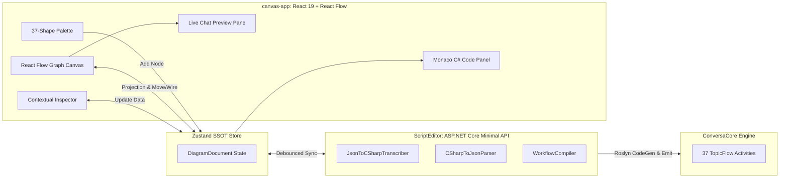

# ScriptEditor: As-Is Architecture & System Documentation (Shipped Baseline)

**Status:** Shipped Baseline (React Flow + Roslyn .NET 9 API)  
**Date:** September 2026  
**Document Purpose:** Authoritative baseline technical documentation of the shipped `ScriptEditor` system, superseding the legacy experimental Blazor/vanilla JS prototype.

---

## 1. Executive Summary & Architecture Overview

`ScriptEditor` is a visual workflow designer and bi-directional code authoring studio for conversational topics and agentic workflows targeting the **ConversaCore** conversational AI framework (.NET 9).

The system replaces the legacy vanilla JavaScript DOM canvas (`editor.js`) and monolithic Blazor page (`Home.razor`) with a modern, decoupled architecture:
1. **Standalone React Flow Frontend (`canvas-app/`):** Built with React 19, TypeScript, Vite, `@xyflow/react`, Zustand, and Monaco Editor. Delivers an n8n-style workflow experience with categorized palettes, contextual node inspection, obstacle-avoiding edge routing, dynamic branching ports, and a live chat preview simulator.
2. **Roslyn .NET 9 Transcription Backend (`ScriptEditor/`):** ASP.NET Core minimal API providing bi-directional JSON ↔ C# transcription (`/api/transcribe/json-to-csharp`, `/api/transcribe/csharp-to-json`), on-demand Roslyn `CSharpCompilation.Emit` + `AssemblyLoadContext` verification (`/api/transcribe/run`), and static hosting of the production canvas bundle at `/canvas`.
3. **JSON Document as Single Source of Truth (SSOT):** Both the visual canvas and Monaco C# code view are passive projections of a unified JSON document (`DiagramDocumentV2` / `diagram.ts`). Cross-surface mutations carry explicit origin tokens (`Canvas`, `CodeEditor`, `Inspector`) to prevent cyclic feedback loops.


```mermaid
flowchart LR
    subgraph Frontend [canvas-app: React 19 + React Flow]
        Palette[37-Shape Palette]
        Canvas[React Flow Graph Canvas]
        Inspector[Contextual Inspector]
        CodeView[Monaco C# Code Panel]
        ChatSim[Live Chat Preview Pane]
    end

    subgraph Store [Zustand SSOT Store]
        JSON[DiagramDocument State]
    end

    subgraph Backend [ScriptEditor: ASP.NET Core Minimal API]
        Transcriber[JsonToCSharpTranscriber]
        Parser[CSharpToJsonParser]
        Compiler[WorkflowCompiler]
    end

    subgraph Framework [ConversaCore Engine]
        Activities[37 TopicFlow Activities]
    end

    Palette -->|Add Node| Store
    Canvas <-->|Projection & Move/Wire| Store
    Inspector <-->|Update Data| Store
    Store <-->|Debounced Sync| Backend
    Backend -->|Roslyn CodeGen & Emit| Framework
    Store --> CodeView
    Canvas --> ChatSim
```

---

## 2. Solution Structure & Layout

```text
ScriptEditor/
├── Program.cs                   # ASP.NET Core minimal API & static /canvas SPA hosting
├── ScriptEditor.csproj          # .NET 9 Web SDK referencing ConversaCore.csproj
├── ScriptEditor.sln             # Solution containing ScriptEditor & ScriptEditor.Tests
│
├── Endpoints/
│   ├── TranscriptionEndpoints.cs# /api/transcribe/json-to-csharp, /csharp-to-json, /run
│   └── WorkflowEndpoints.cs     # /api/workflow/run
│
├── Transcription/
│   ├── JsonToCSharpTranscriber.cs # JSON -> compilable C# TopicFlow with scaffolding
│   ├── CSharpToJsonParser.cs      # Roslyn AST parser mapping C# -> JSON DiagramDocument
│   └── WorkflowCompiler.cs        # In-memory CSharpCompilation.Emit & ALC validation
│
├── Models/
│   ├── Schema/
│   │   └── DiagramSchemaV2.cs   # C# DTOs: DiagramDocumentV2, DiagramNodeV2, DiagramPortV2, DiagramEdgeV2
│   ├── DiagramDocument.cs       # Legacy DTOs preserved for backward compatibility
│   └── DiagramValidation.cs     # Graph integrity validation rules
│
├── Components/
│   ├── App.razor                # Clean Blazor HTML host (editor.js scripts removed)
│   ├── Routes.razor             # Application routing
│   ├── Layout/
│   │   └── MainLayout.razor     # Full-viewport layout container
│   └── Pages/
│       └── Home.razor           # Modern canvas host: embeds /canvas/index.html or dev launcher
│
├── canvas-app/                  # Modern React Flow frontend application
│   ├── package.json             # React 19, @xyflow/react, Zustand, Monaco, Vite, Vitest
│   ├── vite.config.ts           # Vite + Vitest + jsdom configuration
│   ├── src/
│   │   ├── App.tsx              # Main canvas layout with quiet top-level chrome header
│   │   ├── store/               # Zustand SSOT store with origin token enforcement
│   │   ├── schema/diagram.ts    # TypeScript interfaces matching DiagramSchemaV2
│   │   ├── registry/
│   │   │   ├── activityCatalog.ts    # 10 categories, 37 activity shape descriptors
│   │   │   └── activityDefinitions.ts# Port roles, summaries, parameter forms
│   │   ├── components/
│   │   │   ├── DiagramNode.tsx       # Collapsed n8n-style node with auto-stacked ports
│   │   │   ├── RoleEdge.tsx          # Obstacle-aware / loop-lane edge renderer
│   │   │   ├── Palette.tsx           # Category-grouped activity palette + '+' connect mode
│   │   │   ├── Inspector.tsx         # Node parameter configuration drawer & IsRequired toggle
│   │   │   ├── CodePanel.tsx         # Monaco editor with debounced bi-directional sync
│   │   │   └── ChatPreviewPanel.tsx  # Live conversation execution simulator & Roslyn check
│   │   ├── execution/simulateFlow.ts # Edge-graph simulation engine
│   │   └── __tests__/           # 12 test suites, 113 Vitest tests
│   └── dist/                    # Production build bundled by Vite
│
├── ScriptEditor.Tests/          # Backend xUnit test suite (13 passing tests)
│   ├── RoundTripTests.cs        # Full JSON -> C# -> JSON round-trip verification
│   └── WorkflowCompilerTests.cs # Roslyn code emission, scaffolding, and compile tests
│
└── archive/
    └── legacy-canvas/           # Archived obsolete files (Home.razor ~1,400 LOC, editor.js ~2,100 LOC)
```

---

## 3. Data Model & Schema (V2 SSOT)

The authoritative schema is defined symmetrically in `Models/Schema/DiagramSchemaV2.cs` (C#) and `canvas-app/src/schema/diagram.ts` (TypeScript):

### 3.1 Node & Port Contract
* **`DiagramPortV2`**:
  * `id`: Unique port identifier.
  * `direction`: `"input"` | `"output"`.
  * `type`: Type compatibility string (`"string"`, `"control"`, `"any"`, `"adaptive-card"`, etc.).
  * `role`: First-class port role enum:
    * `"main"`: Standard execution flow (solid circle handle, solid wire).
    * `"exception"`: Error propagation (red solid circle handle, red dashed wire).
    * `"control"`: Loop / branching control signals (solid square handle).
    * `"aux-config"`: Auxiliary configuration (diamond handle, dashed wire, e.g. card/model).
* **`DiagramNodeV2`**:
  * `id`: Unique node identifier (e.g. `"LeadDetails"`).
  * `type`: Activity type string corresponding to ConversaCore activity classes (e.g. `"AdaptiveCardActivity"`, `"InvokeToolActivity"`).
  * `name`: Friendly node title displayed in the header.
  * `x`, `y`: Absolute canvas coordinates.
  * `data`: Key-value dictionary of activity parameters (prompts, delays, keys, flags, required toggles).
  * `ports`: Array of `DiagramPortV2` handles auto-stacked on the node boundary.
* **`DiagramEdgeV2`**:
  * `id`: Unique edge identifier.
  * `source`: Node ID.
  * `sourcePort`: Output port ID.
  * `target`: Destination node ID.
  * `targetPort`: Destination input port ID.
  * `role`: Inherited from source port (`"main"`, `"exception"`, `"control"`, `"aux-config"`).

---

## 4. Code Generation & Roslyn Scaffolding Engine

`Transcription/JsonToCSharpTranscriber.cs` transforms the visual JSON graph into an idiomatic, strongly-typed C# class inheriting from `ConversaCore.TopicFlow.Core.TopicFlow`:

### 4.1 Delegate & Tool Scaffolding Pattern
For activities requiring domain logic, lambdas, or external tools (such as `PublishHostNotificationActivity<TPayload>` and `InvokeToolActivity<TTool, TRequest, TResult>`), the transcriber generates named private helper methods on the topic class rather than leaving broken stubs:
* Generates XML doc comments explaining parameter extraction from `TopicWorkflowContext`.
* Provides explicit guidance and throws a descriptive `NotImplementedException("Provide payload/request logic for <ActivityId>")`.
* Prevents silent null failures or compiler errors while clearly signposting where the developer implements custom domain payloads.

### 4.2 Adaptive Cards & Model Context Auto-Dumping
* Emits `AdaptiveCardActivity<TCard, TModel>` with `cardFactory: c => c.Create()` and optional object initializer:
  ```csharp
  Add(new AdaptiveCardActivity<ContactInfoCard, ContactInfoModel>(
      "ContactInfo",
      Context,
      cardFactory: c => c.Create(),
      modelContextKey: "submission_data")
  {
      IsRequired = true
  });
  ```
* Scaffolds `TModel` inheriting from `ConversaCore.Cards.BaseCardModel`.
* Documents that `BaseCardModel.UpdateContext(Context)` automatically dumps model properties into `TopicWorkflowContext` by matching field names.

### 4.3 Bi-Directional Roslyn AST Parsing
`Transcription/CSharpToJsonParser.cs` parses generated or developer-edited C# `TopicFlow` classes back into the JSON graph:
* Recognizes generic activities (`AdaptiveCardActivity<TCard, TModel>`, `PublishHostNotificationActivity<T>`, `InvokeToolActivity<TTool, TRequest, TResult>`).
* Extracts `IsRequired = true/false` object initializers and maps them back to node `data["required"]`.
* Maps tool properties, context keys, and notification channels.

---

## 5. Verification & Test Coverage

The system is continuously verified across both frontend and backend suites:

| Test Suite | Framework | Scope | Status |
| :--- | :--- | :--- | :--- |
| `canvas-app/src/__tests__/` | Vitest / jsdom | 37 activity shapes, port rendering, obstacle routing, origin token loop suppression, chat preview simulation | **113 / 113 Passed** |
| `ScriptEditor.Tests/` | xUnit / .NET 9 | Roslyn C# transcription, AST reverse parsing, scaffolding generation, compilation and load against ConversaCore | **13 / 13 Passed** |
| Parity Audit | Markdown Checklist | Verified parity against `docs/PARITY_REGRESSION_CHECKLIST.md` | **100% Verified** |

---

## 6. Legacy Retirement Summary

The obsolete prototype implementation has been retired and preserved in `archive/legacy-canvas/`:
* `Home.razor` (~1,400 LOC Blazor shell) and partials (`Home.Adaptive.cs`, `Home.DndDiagnostics.cs`, `Home.TargetProject.cs`).
* `editor.js` (~2,100 LOC vanilla JS DOM/SVG canvas engine).
* `layoutEngine.js` and `editor/` subdirectories.
* `Components/App.razor` script references and JSInterop deferral shims completely removed.
