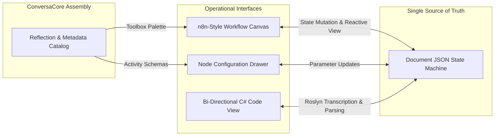
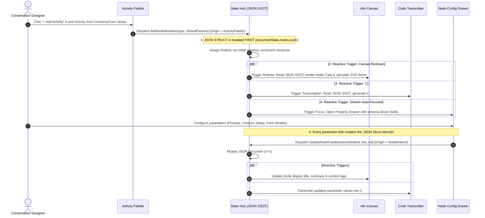
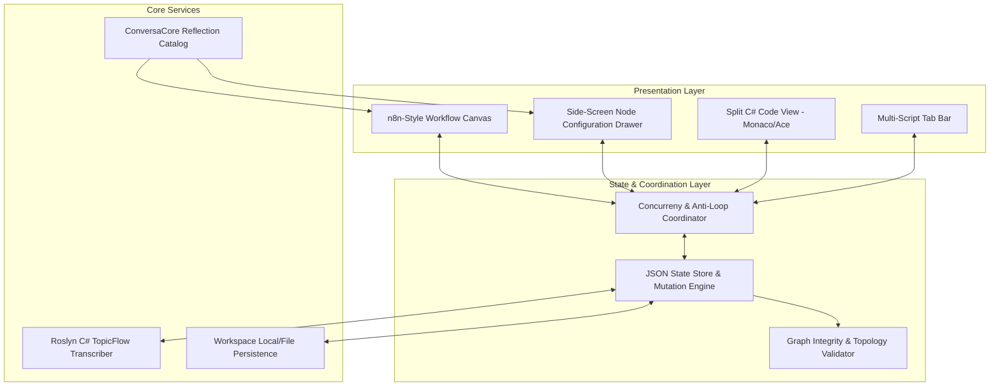
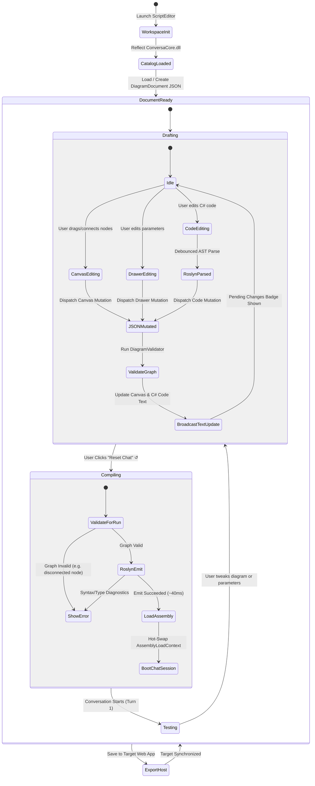

# Concept of Operations (CONOPS): Modernized ScriptEditor

**System Name:** ScriptEditor (Next-Generation Agentic Conversation Designer)  
**Target Platform:** ConversaCore Engine (.NET 9)  
**Document Version:** 1.0 (Draft)  
**Date:** September 2026  

---

## 1. Executive Summary & Operational Vision

### 1.1 Mission Statement
**ScriptEditor** is a visual workflow designer and bi-directional code authoring environment engineered specifically for building agentic conversation flows on the **ConversaCore** conversational AI framework.

Its primary operational goal is to enable conversation designers and software engineers to visually model, configure, inspect, and code multi-turn topics, adaptive forms, semantic LLM steps, and subtopic delegations with high velocity and zero runtime friction.



### 1.2 The Five Core Pillars of the Target Architecture

1. **JSON as the Single Source of Truth (SSOT):**
   * The JSON structure (`DiagramDocument`) is the sole authoritative representation of the conversation flow.
   * Neither the visual canvas nor the code editor owns state. Every user action (dragging a node, typing a parameter, editing code) dispatches a mutation to the JSON structure first; all user interfaces are reactive projections of the current JSON state.

2. **Bi-Directional Synchronization without Loops or Deadlocks:**
   * Changes made in the canvas update the JSON, which triggers live code text transcription.
   * Changes made in the C# code view parse back into JSON, which triggers the canvas to re-render.
   * An **Origin-Token and Version-Stamped Mutation Protocol** ensures changes flow cleanly in one direction per transaction, preventing circular ping-pong updates, UI race conditions, and deadlocks.
   * **Dual-Speed Compilation Lifecycle:** Visual canvas and code text updates happen in real-time (0ms), but **Roslyn in-memory compilation and assembly loading occur on-demand when the chatbot's "Reset" button is pressed**, eliminating compiler churn during drafting.

3. **Dynamic Reflection Catalog (Zero Duplicated Activity Code):**
   * `ScriptEditor` contains **no copies** of framework activity code.
   * Activity types, constructors, properties, and input/output ports are dynamically discovered directly from the referenced `ConversaCore` library via assembly reflection.

4. **n8n-Style Workflow Canvas:**
   * Replaces the legacy manual DOM/SVG engine with a clean, high-performance node graph canvas featuring curved connection wires, execution-order flow indicators, intuitive port docking, minimap, and smooth pan/zoom.

5. **n8n-Style Side-Screen Node Configuration:**
   * Replaces cramped raw-JSON inspector textareas with a slide-out configuration panel tailored to the selected activity.
   * Renders type-safe controls, context variable pickers, adaptive card builders, and live test hooks based on the activity's reflected schema.

---

## 2. User Personas & Operational Roles

| Persona | Primary Needs & Workflow | Key Interface Interaction |
| :--- | :--- | :--- |
| **Conversational Designer** | Rapidly layout conversation paths, define prompts, author adaptive card forms, and configure branching logic without deep C# syntax knowledge. | Uses the **n8n Canvas** to drag activities and connect ports; uses the **Node Configuration Drawer** to write prompts, define options, and build form schemas. |
| **Full-Stack AI Engineer** | Implement complex business rules, inspect context reads/writes, wire custom tools/integrations, and inspect generated C# topic code. | Toggles between the **Visual Canvas** and the **C# Code View**; inspects variable data flows; verifies wiring against the host project. |
| **Framework Developer (ConversaCore Team)** | Add new activity types, policies, or event hooks to `ConversaCore` and verify they are immediately available in the editor without modifying `ScriptEditor`. | Compiles `ConversaCore`; opens `ScriptEditor`; the new activities automatically populate in the toolbox with proper ports and parameters. |

---

## 3. Operational Scenarios & User Journeys

### Scenario A: Visual Authoring via Activity Palette, JSON SSOT & Reactive Triggers


### Scenario B: Round-Trip Code Editing (C# ➔ JSON ➔ Canvas)
When a developer or AI edits the C# code directly (e.g., physically deleting `Activity10`):

```mermaid
sequenceDiagram
    autonumber
    actor Dev as Developer / AI
    participant Code as C# Code Editor
    participant Roslyn as Roslyn AST Parser
    participant Hub as State Hub (JSON SSOT)
    participant Canvas as n8n Canvas
    participant Chat as ConversaCore.UI Chatbot

    Note over Dev,Canvas: 1. Code Edit & AST Parse
    Dev->>Code: Physically deletes Add(new Activity10(...))
    Code->>Roslyn: Debounced syntax inspection (~350ms)
    Roslyn->>Roslyn: AST walks BuildWorkflow() — Activity10 is gone!
    Roslyn->>Hub: Dispatch RemoveNodeMutation("activity-10") [Origin = CodeEditor]
    
    Note over Hub,Canvas: 2. JSON SSOT Mutated & Canvas Reflected
    Hub->>Hub: Update JSON Document (v+1)
    
    par Update Canvas View
        Hub->>Canvas: Notify StateUpdated [Origin = CodeEditor]
        Canvas->>Canvas: Remove Activity10 card & heal connection wires!
    and Echo Suppression (Anti-Loop)
        Hub--xCode: Suppressed! (Origin == CodeEditor; avoids feedback loop)
    and Chatbot Status
        Hub->>Chat: Update badge: "● Changes Pending (Reset to Apply)"
    end

    Note over Dev,Chat: 3. JIT Recompile & Run
    Dev->>Chat: Click "Reset Chat" ↺
    Chat->>Hub: Compile clean C# in RAM (~35ms)
    Chat->>Chat: Starts fresh session without Activity10!
```

1. The developer opens the **C# Code View** alongside the canvas.
2. In the C# code view, the developer modifies or deletes an activity (e.g., removing `Add(new Activity10(...));`).
3. When typing pauses (debounced ~350ms):
   * The **Roslyn Syntax Parser** walks the C# AST and detects that `Activity10` is missing from the workflow queue.
   * Dispatches `RemoveNodeMutation("activity-10", Origin: CodeEditor)` to the State Hub.
4. The State Hub updates the JSON structure, increments `versionId`, and broadcasts the change.
5. **The Canvas receives the event and updates immediately:** `Activity10` card disappears from the canvas, and adjacent connection splines dynamically reconnect/heal.
6. **Anti-Loop Echo Suppression:** The Code Editor drops the incoming event because `Origin == CodeEditor`, preventing circular text replacement or cursor jumps.
7. The chatbot badge displays `● Changes pending (Click Reset to recompile)` until **Reset** is clicked.

### Scenario C: Dynamic Extension from `ConversaCore`
1. A developer adds a new activity class to `ConversaCore`:
   ```csharp
   public class ToolCallActivity : TopicFlowActivity { ... }
   ```
2. The developer builds the solution.
3. `ScriptEditor` re-reads the assembly metadata via `ConversaCoreActivityCatalog`:
   * Identifies `ToolCallActivity` inheriting from `TopicFlowActivity`.
   * Inspects constructor arguments and properties.
   * Auto-generates a toolbox item with an icon, input port, output port, and exception port.
4. The user drags `ToolCallActivity` onto the canvas immediately—**zero lines of code changed in `ScriptEditor`**.

---

## 4. System Subsystems & Architecture



### 4.1 Subsystem 1: The JSON SSOT Engine
* **Core Contract:** Holds the active `DiagramDocument` in memory.
* **Mutation Pipeline:** All updates pass through atomic mutation commands:
  * `AddNodeCommand`
  * `MoveNodeCommand`
  * `DeleteNodeCommand`
  * `ConnectEdgeCommand`
  * `DisconnectEdgeCommand`
  * `UpdateNodeDataCommand`
  * `UpdateNodePortsCommand`
  * `ReplaceDocumentCommand`
* **Invariant:** Every mutation results in an immutable clone of the document, validation check, and broadcast.

### 4.2 Subsystem 2: The Anti-Loop & Concurrency Coordinator
To ensure zero deadlocks and zero circular updates during bi-directional synchronization:
* **Mutation Origin:** Every update request carries an `Origin` enum:
  ```csharp
  public enum ChangeOrigin
  {
      Canvas,
      NodeDrawer,
      CodeEditor,
      ExternalFile,
      WorkspaceLoad
  }
  ```
* **Echo Suppression:** When a view receives a state update notification from the SSOT Hub, it checks `event.Origin`. If `event.Origin == view.Id`, the view ignores the incoming notification.
* **Debouncing & Sequence Numbering:** Code parsing is debounced (e.g. 350–500ms). Each document state increment has a monotonic `VersionId`. Stale or out-of-order mutations are rejected atomically.

### 4.3 Subsystem 3: Dynamic `ConversaCore` Reflection Catalog
* **Responsibility:** Scan `ConversaCore.dll` and extract activity descriptors.
* **Metadata Extracted:**
  * Activity Name and Category (Messaging, Cards, Logic, Branching, Integration, AI).
  * Allowed Input/Output ports (Standard Next, Branching Cases, Exception port).
  * Configurable parameters (constructor parameters, public properties decorated with attributes or conventional names).
  * Context variable dependencies (which properties read or write to `TopicWorkflowContext`).

### 4.4 Subsystem 4: n8n-Style Workflow Canvas
* **Look & Feel:** Clean modern dark/light grid canvas; rounded rectangular node cards with distinct status headers, category badges, and active state indicators.
* **Connection Routing:** Smooth cubic bezier curves with directional flow animations.
* **Ports:** Distinct circular anchors with hover-expand affordance; color-coded by payload type (`flow`, `string`, `model`, `exception`).
* **Canvas Controls:** Pan, zoom (scroll-wheel and pinch), multi-node select, auto-align (horizontal/vertical layout), minimap in bottom-right corner.

### 4.5 Subsystem 5: n8n-Style Node Configuration Drawer
* Slides out smoothly from the right side when a node is clicked (or double-clicked).
* **Sections:**
  1. **Header:** Node display name, activity type badge, documentation link, enable/disable toggle.
  2. **Parameters Form:** Schema-generated form inputs for the selected activity (e.g. for `PromptActivity`: Prompt Template textarea, temperature slider, model dropdown).
  3. **Context Bindings:** Explicit variable readers and writers (`Reads: ["LeadInfo"]`, `Writes: ["QualificationResult"]`).
  4. **Output Preview:** Visual preview of output ports and condition branches.
  5. **Live Test Hook:** Sandbox button to test activity execution in isolation.

### 4.6 Subsystem 6: Roslyn C# Code Transcriber & JIT Execution Engine
* **Transcriber (JSON ➔ C# Code Text):**
  * Emits clean, idiomatic C# `partial class [TopicName] : TopicFlow`.
  * Generates `BuildWorkflow()` containing `Add(new [Activity](...))` invocations matching the graph topology in real-time as the JSON changes.
* **Parser (C# Code Text ➔ JSON):**
  * Uses Roslyn `CSharpSyntaxTree` to walk the `Add(...)` expressions in `BuildWorkflow()`.
  * Extracts activity instantiation statements and reconstructs nodes, arguments, and sequential/conditional edge connections.
* **JIT In-Memory Compiler (`CSharpCompilation.Emit` on Chatbot Reset):**
  * Does NOT compile during drafting/dragging.
  * When the user clicks **Reset** on the chatbot panel:
    1. Validates the JSON graph via `DiagramValidator`.
    2. Takes the generated C# syntax tree and invokes Roslyn's in-memory compilation (`CSharpCompilation.Emit`).
    3. Unloads the prior `AssemblyLoadContext` and loads the new assembly into RAM in ~30–50ms.
    4. Instantiates the fresh `TopicFlow` and restarts the `ConversaCore.UI` chat session.

---

## 5. Operational Life-Cycle of a Script



---

## 6. Safety, Resilience, and Error Handling

1. **Deadlock & Infinite Loop Prevention:**
   * Single-writer thread serialization in Blazor.
   * Distinct transaction IDs with origin metadata prevent ping-pong event amplification.
2. **Syntax Error Resilience in Code Editor:**
   * If the user introduces a C# syntax error in the code view, the Roslyn parser reports diagnostics in the code editor gutter, but **does not corrupt or overwrite** the valid JSON document state.
   * Only syntactically valid C# updates are dispatched to the JSON store.
3. **Graph Integrity Safeguards:**
   * Edge cycles in linear sections are detected and flagged.
   * Multiple connections into a single input port are prevented unless specifically routed into a collector/composite node.
   * Disconnected activities or missing required ports are marked with inline warning badges.

---

## 7. Operational Benefits of the New Design

| Feature | Legacy As-Is Prototype | Modernized To-Be ScriptEditor |
| :--- | :--- | :--- |
| **Canvas UX** | Brittle custom DOM elements, laggy drag-and-drop, manual Dagre repositioning | Fluid, responsive n8n-style canvas with smooth splines and keyboard shortcuts |
| **Node Editing** | Typing raw JSON strings into sidebar textareas | Dedicated side-screen drawer with dedicated form controls, dropdowns, and previews |
| **Activity Synchronization** | 40 copied `.cs` files with build exclusions | Direct runtime reflection from `ConversaCore.dll`; instant sync upon framework build |
| **Code Generation** | Non-existent (must manually rewrite diagrams into C#) | Full bi-directional C# transcription powered by Roslyn; seamless round-tripping |
| **State Cohesion** | Split between JS DOM, Blazor memory, and text drafts | Strict JSON Single Source of Truth; predictable, observable, loop-free |

---

## 8. Summary & Next Actions

This Concept of Operations establishes the architectural foundation and operational baseline for the modernization of `ScriptEditor`.

### Key Immediate Action Items:
1. **Repository Cleanup:** Delete `Activities/` duplicate folder; remove `<Compile Remove...>` in `ScriptEditor.csproj`.
2. **Metadata Engine:** Build `ConversaCoreReflectionService` to dynamically inspect `ConversaCore.dll`.
3. **Canvas Prototype:** Introduce the modern workflow canvas shell and implement the origin-stamped JSON State Hub.
4. **Configuration Drawer:** Build the schema-driven side-screen node editor.
5. **Roslyn Integration:** Implement the C# `TopicFlow` parser and code generator.
