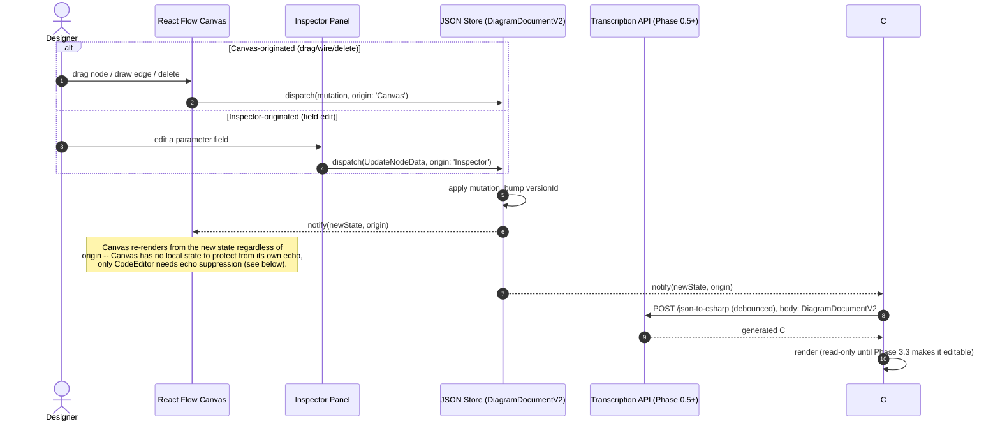

# ADR 0002: Origin-token sync protocol for the JSON SSOT

## Status
Accepted

## Context
`docs/CONCEPT_OF_OPERATIONS.md` §2.1-2.2 and §4.2 already mandate that the
JSON document is the single source of truth and that every cross-surface
mutation must carry an origin token to prevent circular updates (Canvas
writes trigger a code regen, which re-parses and writes back to Canvas,
which re-triggers code regen, forever). That doc's sequence diagrams
(Scenario A/B) and its `ChangeOrigin` enum were written assuming a Blazor
Server host with a live, always-connected "State Hub" pushing to multiple
server-rendered views over SignalR.

The architecture actually being built (`docs/superpowers/plans/2026-09-12-n8n-canvas-rewrite.md`)
is different in one load-bearing way: **the canvas is a standalone
client-side React app** (`canvas-app/`, Phase 0.2), and the only server
round-trip is a stateless, debounced HTTP call to a separate Roslyn
transcription API (Phase 0.5+). There is no live multi-client push hub to
design around — "the Hub" is a single in-memory store inside one browser
tab (Zustand/Redux, to be chosen in Phase 2.1). This ADR restates the CONOPS
protocol precisely for that actual shape, per Phase 0.4's acceptance
criteria, rather than leaving the SignalR-flavored original as the
literal spec for Phase 2 to implement against.

## Decision

### Origin token values
Three values, matching the roadmap's own Global Constraints section exactly
(a deliberate narrowing of CONOPS §4.2's five-value `ChangeOrigin` enum, since
`ExternalFile` and `WorkspaceLoad` describe scenarios — importing a file,
initial page load — that are not cross-surface mutations in the loop-prevention
sense; they're one-time document replacements with no originating *view* to
suppress an echo against):

```ts
type MutationOrigin = 'Canvas' | 'CodeEditor' | 'Inspector';
```

- `Canvas` — a drag, wire, delete, or other direct manipulation on the
  React Flow surface.
- `Inspector` — an edit made in the node configuration side panel (CONOPS
  §4.5; renamed from CONOPS's `NodeDrawer` to match the roadmap's Phase 1.5
  naming — same concept, one rename for consistency).
- `CodeEditor` — a change reconstructed from parsing edited C# text
  (Phase 3.2's Roslyn AST walk).

A one-time full-document load (initial fixture, opening a saved script) is
**not** a mutation and carries no origin token at all — it's a
`ReplaceDocumentCommand` (CONOPS §4.1) applied before any view has rendered,
so there is nothing to echo-suppress against yet.

### The one JSON store
A single store, owned by `canvas-app`, holds the current `DiagramDocumentV2`
(`docs/schema/diagram-schema-v2.md`) in memory. Every mutation is a plain
function call into this store (not a network call) — Canvas and Inspector are
both already running in the same browser tab as the store, so "dispatch" here
means an in-process reducer call, not a message send. `CodeEditor`-originated
mutations are the one path that *does* cross a process boundary first (React
app → Roslyn API → back to React app), described below.

### Mutation flow, direction 1: Canvas or Inspector → JSON → [redraw, code regen]



Both `Canvas` and `Inspector` origins take the identical downward path —
there is no echo-suppression case for either of them, because neither the
canvas nor the code preview owns state that a same-origin notification could
corrupt by reapplying. The origin tag is recorded and forwarded regardless,
purely so a future consumer (analytics, undo grouping, Phase 3.5's error
surfacing) can attribute a document version to what produced it.

### Mutation flow, direction 2: CodeEditor → JSON → Canvas (the loop-prevention case)

```mermaid
sequenceDiagram
    autonumber
    actor Dev
    participant Code as C# Code Editor (Phase 3.3+)
    participant API as Transcription API
    participant Store as JSON Store
    participant Canvas as React Flow Canvas

    Dev->>Code: types, deletes an Add(new Activity10(...)) line
    Code->>Code: debounce ~350ms
    Code->>API: POST /csharp-to-json, body: edited C# text
    API->>API: Roslyn CSharpSyntaxTree walk of BuildWorkflow()
    alt syntax valid
        API-->>Code: parsed DiagramDocumentV2
        Code->>Store: dispatch(ReplaceDocumentCommand, origin: 'CodeEditor')
        Store->>Store: apply, bump versionId
        Store-->>Canvas: notify(newState, origin: 'CodeEditor')
        Canvas->>Canvas: re-render (Activity10 card removed, edges heal)
        Note over Code,Store: Echo suppression: the notification is NOT<br/>routed back into a fresh json-to-csharp call, because<br/>the text that produced this state already IS the current<br/>code-editor content. Re-transcribing it would be redundant<br/>work at best and, if the round-trip isn't perfectly<br/>idempotent, a text-formatting fight with the user's cursor<br/>at worst.
    else syntax error
        API-->>Code: diagnostics (line/column/message)
        Code->>Code: surface in gutter; Store is NOT touched
        Note over Store: Phase 3.5: last-valid document is untouched --<br/>a syntax error can never corrupt the JSON SSOT.
    end
```

### How the loop-prevention rule is actually enforced
CONOPS §4.2 states the rule abstractly ("if `event.Origin == view.Id`, the
view ignores the notification"). Concretely, in this architecture, there is
exactly **one** place this check needs to exist, not one per view:

```ts
function onStoreChange(newState: DiagramDocumentV2, origin: MutationOrigin) {
  renderCanvas(newState);            // always -- Canvas never originates
                                      // a notification it then has to ignore
  renderInspectorIfSelectionValid(newState); // always, same reason

  if (origin !== 'CodeEditor') {
    requestJsonToCSharp(newState);   // debounced call to the transcriber
  }
  // origin === 'CodeEditor': skip -- this state IS the code editor's own
  // text, reflected back. Re-requesting a transcription of it is the loop.
}
```

Canvas and Inspector don't need an echo check because they're pure read
projections of the store with no local buffer that a redundant re-render
could desync — re-rendering from the same state twice is a no-op, not a
bug. `CodeEditor` is the one view with an actual local buffer (the text the
developer is mid-typing), so it's the one place a same-origin echo would
visibly misbehave (cursor jumps, reformatted text fighting the keystroke) —
hence the rule is really just: *a `CodeEditor`-tagged mutation does not
trigger a new `json-to-csharp` transcription request.* Every other
propagation happens unconditionally.

### Versioning / stale-mutation rejection
Per CONOPS §4.2, every store state carries a monotonic `versionId`. A
`csharp-to-json` response is applied only if no newer mutation has landed
in the store while that debounced request was in flight (`response.baseVersionId
=== store.versionId` at apply time); otherwise it's discarded and the code
editor's next debounce cycle will naturally re-derive from current text. This
avoids adding real concurrency (there is only one store, one tab, one document)
while still being correct if a Canvas edit and a debounced code-parse race.

## Consequences
- Phase 2.1 (central JSON store) implements exactly the `onStoreChange`
  dispatch shown above; Phase 2.3's regression test ("a code-edit-originated
  mutation does not re-trigger a code-regen request") is this ADR's loop-
  prevention rule made executable.
- Phase 3.3 (wire frontend to transcription API, debounced) and Phase 3.5
  (syntax error handling without state corruption) implement the two
  branches of the direction-2 diagram above directly.
- `WorkspaceLoad` and `ExternalFile` from CONOPS's original enum are
  deliberately not part of the mutation-origin type. If a future phase adds
  multi-document import/export, it should be modeled as a
  `ReplaceDocumentCommand` with no origin (same as initial load), not as a
  fourth mutation origin — there's no view to suppress an echo against.
